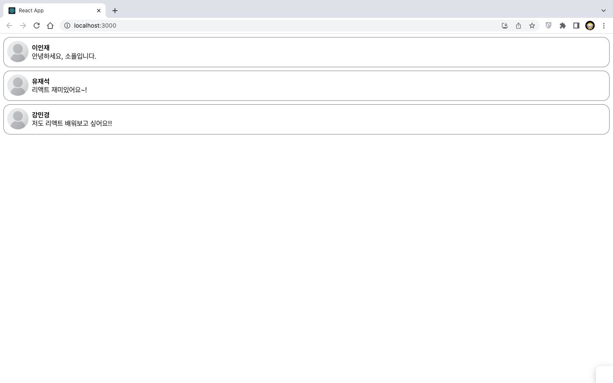
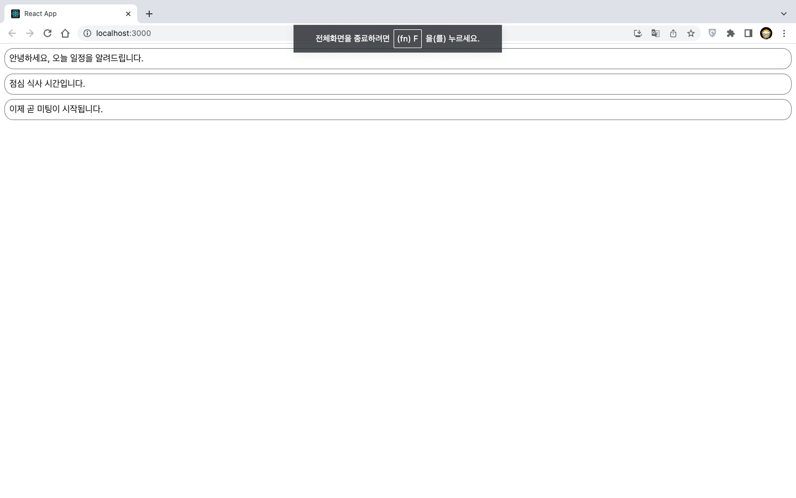
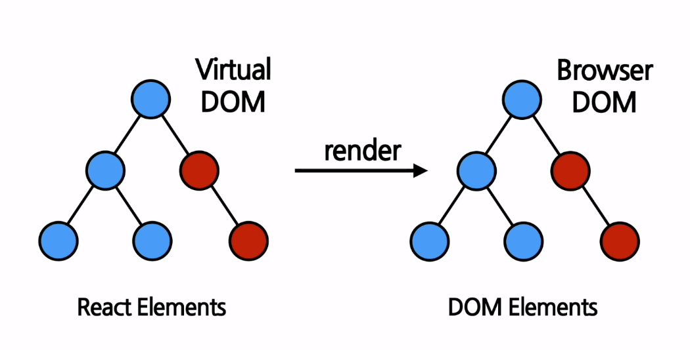

23-React1 김해찬
===========
05.04 10주차 수업내용
------------
### 1. 리스트와 키란 무엇인가?
* 자바스크립트의 변수나 객체를 하나의 변수로 묶어 놓은 것
```js
const numbers = [1,2,3,4,5];
```
* 키는 각 객체나 아이템을 구분할 수 있는 고유의 값
### 2. 여러 개의 컴포넌트 랜더링 하기
* map() 함수는 배열에 들어있는 각 변수에 어떤 처리를 한 뒤 리턴하는 것
```js
const doubled = numbers.map((number) => number * 2); 
```
* 실제로 랜더링을 하는 예제 코드
```js
const numbers = [1,2,3,4,5];
const listItems = numbers.map((number) => <li>{number}</li>);

ReactDOM.render(
    <ul>{listItems}</ul>
    document.getElementById('root');
);
```
### 3. 기본적인 리스트 컴포넌트
* 밑 예제는 키 값이 없다는 오류가 출력 됨
```js
function NumberList(props){
    const { numbers } = props;

    const listItems = numbers.map((number) => <li>{number}</li>);

    return(
        <ul>{listItems}</ul>
    );
}

const numbers = [1, 2, 3, 4, 5];
ReactDOM.render(
    <NumberList numbers={numbers}/>,
    document.getElementById('root')
);
```
### 4. 리스트의 키에 대해 알아보기
* 리스트에서 아이템을 구분하기 위한 고유한 문자열
* 리액트에서의 키의 값은 같은 리스트에 있는 엘리먼트 사이에서만 고유한 값이면 됨

* 키 값으로 숫자의 값을 사용한 방법
```js
const numbers = [1, 2, 3, 4, 5];
const listItems = numbers.map((number) =>
    <li key={number.toString()}>
        {number}
    </li>
);
```
* 키값으로 id를 사용하는 방법
```js
const todoItems = todos.map((todo) =>
    <li key={todo.id}>
        {todo.text}
    </li>
);
```
* 키값으로 index를 사용하는 방법
* 리액트에서는 키를 명시적으로 넣어 주지 않으면 기본적으로 이 인덱스 값을 키값으로 사용함
```js
const todoItems = todos.map((todo, index) =>
    <li key={index}>
        {todo.text}
    </li>
);
```
### 5. 출석부 출력하기 (실습)
```js
//AttendanceBook.jsx
import React from "react";

const students = [
    {
        id : 1,
        name: "Inje",
    },
    {
        id : 2,
        name: "Steve",
    },
    {
        id : 3,
        name: "Bill",
    },
    {
        id : 4,
        name: "Jeff",
    },
];

function AttendanceBook(props){
    return(
        <ul>
            {students.map((student) => {
                return <li>{student.name}</li>;
            })}
        </ul>
    );
}

export default AttendanceBook;
```
### 6. 폼이란 무엇인가
* 사용자로부터 입력을 받기 위해 사용하는 것
```js
<form>
    <label>
        이름 :
        <input type="text" name="name" />
    </label>
    <button type="submit">제출</button>
</form>
```
### 7. 제어 컴포넌트
* 사용자가 입력한 값에 접근하고 제어할 수 있도록 해주는 컴포넌트
* 제어 컴포넌트는 그 값이 리액트의 통제를 받는 입력 폼 엘리먼트
```js
function NameForm(props){
    const [value, setValue] = useState('');

    const handleChange = (event) => {
        setValue(event.target.value);
    }

    const handleSubmit = (event) => {
        alert(`입력한 이름: ` + value);
        event.preventDefault();
    }

    return(
        <form onSubmit={handleSubmit}>
            <label>
                이름 :
                <input type="text" value={value} onChange={handleChange} />
            </label>
        </form>
    )
}
```
* 사용자가 입력한 값을 모두 대문자로 변환
```js
const handleChange = (event) => {
    setValue(event.target.value.toUpperCase());
}
```
### 8. textarea 태그
```js
function RequestForm(props){
    const [value, setValue] = useState('요청사항을 입력하세요.');

    const handleChange = (event) => {
        setValue(event.target.value);
    }

    const handleSubmit = (event) => {
        alert('입력한 요청사항: ' + value);
        event.preventDefault();
    }

    return(
        <form onSubmit={handleSubmit}>
            <label>
                요청사항:
                <textarea value={value} onChange={handleChange} />
            </label>
            <button type="submit">제출</button>
        </form>
    )
}
```
04.27 9주차 수업내용
------------
### 1. 이벤트 처리하기
* DOM에서 클릭이벤트를 처리하는 방법
```js
    <button onclick="activate()">
        Activate
    </button>
```
* 리액트에서 클릭이벤트를 처리하는 방법
```js
    <button onClick={activate}>
        Activate
    </button>
```
* 이벤트 핸들러를 추가하는 방법
```js
class Toggle extends React.Component {
    constructor(props){
        super(props);

        this.state = { isToggleOn: true};

        // callback 에서 `this`를 사용하기 위해서는 바인딩이 필수
        this.handleClick = this.handleClick.bind(this);
    }

    handleClick(){
        this.setState(prevState => ({
            isToggleOn: !prevState.isToggleOn
        }));
    }

    reunder(){
        return(
            <button onClick={this.handleClick}>
                {this.state.isToggleOn ? '켜짐' : '꺼짐'}
            </button>
        )
    }
}

```
* 클래스 필드 문법을 사용하여 코드 간략화
```js
class MyButton extends React.Component{
    handleClick = () => {
        console.log('this is:' , this);
    }

    render(){
        return (
            <button onClick={this.handleClick}>
                클릭
            </button>
        );
    }
}
```
* this문법 대신 화살표 함수를 사용하는 방법
```js
class MyButton extends React.Component{
    handleClick() {
        console.log('this is:' , this);
    }

    render(){
        return (
            <button onClick={() => this.handleClick()}>
                클릭
            </button>
        );
    }
}
```
* 클래스 컴포넌트를 함수 컴포넌트로 변경
```js
function Toggle(props){
    const [istToggleOn, setIsToggleOn] = useState(true);
    
    // 방법 1. 함수 안에 함수로 정의
    function handelClick(){
        setIsToggleOn((isToggleOn) => !isToggleOn);
    }

    //방법 2. arrow function을 사용하여 정의
    const handleClick = () => {
        setIsToggleOn((isToggleOn) => !isToggleOn);
    }
    
    return(
        <button onClick={handleClick}>
            {isToggleOn ? "켜짐" : "꺼짐"}
        </button>
    );
}
```

### 2. Arguments 전달하기
* Arguments란 함수에 전달할 데이터를 말함
* 흔히 매개변수라고 부름
```js
<button onClick={(event) => this.deleteItem(id, event)}>삭제하기</button>
<button onClick={this.deleteItem.bind(this, id)}>삭제하기</button>
```
* 함수컴포넌트에서 매개변수를 전달하는 방법
```js
function MyButton(props){
    const handleDelete = (id, event) =>{
        console.log(id, event.target);
    };

    return(
        <button onClick={(event) => handleDelete(1, event)}>삭제하기</button>
    );
}
```

### 3. 클릭 이벤트 처리하기(실습)
```js
import React, { useState } from "react";

function ConfirmButton(props){
    const [isConfirmed, setIsConfirmed] = useState(false);

    const handleConfirm = () => {
        setIsConfirmed((prevIsConfirmed) => !prevIsConfirmed);
    };

    return(
        <button onClick={handleConfirm} disabled={isConfirmed}>
            {isConfirmed ? "확인됨" : "확인하기"}
        </button>
    );
}

export default ConfirmButton;
```

### 4. 조건부 렌더링이란
* 어떠한 조건에 따라서 렌더링이 달라지는 것
```js
function UserGreeting(props){
    return <h1>다시 오셨군요!</hi>;
}

function GuestGreeting(props){
    return <h1>회원가입을 해주세요.</h1>;
}

function Greeting(props){
    const isLoggedIn = props.isLoggedIn;
    if(isLoggedIn){
        return <UserGreeting />;
    }
    return <GuestGreeting />;
}
```

### 5. 엘리번트 변수
* 렌더링 할 컴포넌트를 변수처럼 다루는 기법
```js
function LoginButton(props){
    return(
        <button onClick={props.onClick}>
            로그인
        </button>
    );
}

function LogoutButton(props){
    return(
        <button onClick={props.onClick}>
            로그아웃
        </button>
    );
}

function LoginControl(props){
    const [isLoggedIn, setIsLoggedIn] = useState(false);

    const handleLoginClick = () => {
        setIsLoggedIn(true);
    }

    const handleLogoutClick = () => {
        setIsLoggedIn(false);
    }

    let button;
    if(isLoggedIn) {
        button = <LogoutButton onClick={handleLogoutClick} />;
    }else{
        button = <LoginButton onClick={handleLoginClick} />;
    }

    return(
        <div>
            <Greeting isLoggedIn={isLoggedIn} />
            {button}
        </div>
    )
}
```
### 6. 인라인 조건
* 조건문을 코드 안에 집어 넣는 것
```js
//인라인 if 예제
true && expression -> expression
false && expression -> false
```
* 인라인 If를 JSX 코드 안에서 사용하는 방법
```js
function MailBox(props){
    const unreadMessages = props.unreadMessages;

    return(
        <div>
            <h1>안녕하세요!</h1>
            {unreadMessages.length > 0 &&
                <h2>
                    현재 {unreadMessages.length}개의 읽지 않은 메시지가 있습니다.
                </h2>
            }
        </div>
    );
}
```
* 인라인 If - Else
```js
function UserStatus(props){
    return(
        <div>
            이 사용자는 현재 <b>{props.isLoggedIn ? `로그인` : `로그인하지 않은`}</b> 상태입니다.
        </div>
    )
}
```
### 7. 컴포넌트 렌더링 막기
* 조건부 렌더링에서 null을 return 하면 컴포넌트가 렌더링 되는 것을 막을 수 있음
```js
function WariningBanner(props){
    if (!props.warning){
        return null;
    }

    return(
        <div>경고!</div>
    );  
}
```
### 8. 로그인 여부를 나타내는 툴바 만들기(실습)
```js
//Toolbar.jsx
import React from "react";

const style = {
    wrapper: {
        padding: 16,
        display: "flex",
        flexDirection: "row",
        borderBottom: "1ox solid grey",
    },
    greeting:{
        marginRight: 8,
    },
};

function Toolbar(props){
    const { isLoggenIn, onClickLogin, onClickLogout } = props;

    return(
        <div style={style.wrapper}>
            {isLoggedIn && <span style={style.greeting}>환영합니다!</span>}

            {isLoggedIn ? (
                <button onClick={onClickLogout}>로그아웃</button>
            ): (
                <button onClick={onClickLogin}>로그인</button>
            )}
        </div>
    );
}

export default Toolbar;
```
```js
//LandingPage.jsx
import React, { useState } from "react";
import Toolbar from "./Toolbar";

function LandingPage(props){
    const [isLoggedIn, setIsLoggedIn] = useState(false);

    const onClickLogin = () => {
        setIsLoggedIn(true);
    };

    const onClickLogout = () => {
        setIsLoggedIn(false);
    };

    return(
        <div>
            <Toolbar
                isLoggedIn={isLoggedIn}
                onClickLogin={onClickLogin}
                onClickLogout={onClickLogout}
            />
            <div style={{ padding: 16}}>소플과 함께하는 리액트 공부!</div>
        </div>
    );
}

export default LandingPage;
```
04.13 7주차 수업내용
------------
### 1. 훅이란 무엇인가
* 클래스 컴포넌트에서는 생성자에서 state를 정의하고 setState() 함수를 했음.
* 함수컴포넌트에서는 그 역할을 훅(Hook)이 대신 수행함.
* 훅의 이름은 모두 use로 시작하게 되어있음.

### 2. useState
* state를 사용하기 위한 훅
* 함수 컴포넌트에서는 기본적으로 state를 제공하지 않기 떄문.
```js
import React, { useState } from "react";

function Counter(props){
    var count = 0;

    return(
        <div>
            <p>총 {count}번 클릭했습니다.</p>
            <button onClick={() => count++}>
                클릭
            </button>
        </div>
    );
}
```
* 이런식으로 코드를 짤 경우 count변수의 값은 올라가지만 랜더링이 안됨
* 따라서 새로운 카운트 값이 화면에 표시되지 않음
```js
const[변수명, set함수명] = useState(초기값);
```
```js
import React, { useState } from "react";

function Counter(props){
    const [count, setCount] = useState(0);

    return(
        <div>
            <p>총 {count}번 클릭했습니다.</p>
            <button onClick={() => setCount(count + 1)}>
                클릭
            </button>
        </div>
    );
}
```
### 3. UseEffect
* 클래스 컴포넌트에서 제공하는 생명주기 함수와 같은 기능을 제공함.
* 첫 번째 파라미터로는 이펙트 함수, 두 번째 파라미터로는 의존성 배열이 들어감.
* 의존성 배열 안에 있는 변수 중에 하나라도 값이 변경되었을 때 실행됨
* 만약 이펙트 함수가 마운트와 언마운트시에 단 한번씩만 실행되게 하고 싶으면 빈배열([])을 넣으면 됨

```js
import React, {useState, useEffect} from "react";

function Counter(props){
    const [count, setCount] = useState(0);

    useEffect(()=> {
        document.title = `총 ${count}번 클릭했습니다.`;
    });
    //의존성 배열 파라미터를 선언을 하지 않으면 리액트DOM 자체가 의존성 배열이 됨.

    return(
        <div>
            <p>총 {count}번 클릭했습니다.</p>
            <button onClick={() => setCount(count + 1)}>
                클릭
            </button>
        </div>
    );
}
```
* useEffect로 componentWillUnmount기능 구현하기
```js
import React, { useState, useEffect } from "react";

function UserStatus(props){
    const [isOnline, setIsOnline] = useState(null);

    function handleStatusChange(status){
        setIsOnline(status.isOnline);
    }

    useEffect(() => {
        ServerAPI.subscribeUserStatus(props.user.id, handleStatusChange);
        return () => {
            ServerAPI.unsubscribeUserStatus(props.user.id, handleStatusChange);
        };
    });

    if(isOnline == null){
        return '대기 중...';
    }
    return isOnline ? '온라인' : '오프라인';
}
```
* useEffect() 훅은 하나의 컴포넌트에 여러개를 사용 할 수 있음.
```js
function UserStatusWithCounter(props){
    const [isOnline, setIsOnline] = useState(null);
    useEffect(()=> {
        document.title = `총 ${count}번 클릭했습니다.`;
    });

    function handleStatusChange(status){
        setIsOnline(status.isOnline);
    }

    useEffect(() => {
        ServerAPI.subscribeUserStatus(props.user.id, handleStatusChange);
        return () => {
            ServerAPI.unsubscribeUserStatus(props.user.id, handleStatusChange);
        };
    });

    function handleStatusChange(status){
        setIsOnline(status.isOnline);
    }
}
```
### 4.useMemo 
* Momized value를 리터는하는 훅
```js
    const memoizedValue = useMemo(
        () => {
            return computeExpesiveValue(의존성 변수1, 의존성 변수2);
        },
        [의존성 변수1, 의존성 변수2]
    );
```

04.06 6주차 수업내용
------------
### 1. 컴포넌트의 종류
* 함수 컴포넌트
* 클래스 컴포넌트
### 2. 함수 컴포넌트
```js
    function Welcome(props){
        return <h1>안녕, {props.name}</h1>;
    }
```
* props객채를 받아 엘리먼트를 리턴하기 때문에 함수 컴포넌트라고 할 수 있음.
### 3. 클래스 컴포넌트
```js
    class Welcome extends React.Component{
        render(){
            return <h1>안녕, {this.props.name}</h1>;
        }
    }
```
* 모든 클래스 컴포넌트는 React.Component를 상속 받음.
### 4. 컴포넌트 이름 짓기
* 컴포넌트의 이름은 항상 대문자로 시작해야 한다.
```js
    // HTML div 태그로 인식
    const element = <div />;

    // Welcome이라는 리액트 컴포넌트로 인식
    const element = <Welcome name="인제" />;
```
### 5. 컴포넌트 랜더링
```js
    function Welcome(props){
        return <h1>안녕, {props.name}</h1>;
    }

    const element = <Welcome name="인제" />;
    ReactDOM.render(
        element,
        document.getElementById('root');
    );
```
* Welcome이라는 함수 컴포넌트를 선언
* <Welcome name="인제" /> 라는 값을 가진 엘리먼트를 생성
* 생성된 엘리먼트를 파라미터로 ReactDOM.reander()를 호출
* Welcome 컴포넌트에 {name: "인제" }라는 props를 넣어 호출
* React DOM 을 통해 브러우저로 출력
### 5. 컴포넌트 합성
* 여러 개의 컴포넌트를 합쳐서 하나의 컴포넌트를 만드는 것.
```js
    function Welcome(props){
        return <h1>Hello, {props.name}</h1>;
    }

    function App(props){
        return(
            <div>
                <Welcome name="Mike"/>
                <Welcome name="Steve" />
                <Welcome name="Jane" />
            </div>
        )
    }

    ReactDOM.render(
        <App />,
        document.getElementById('root')
    );
```
* Welcome 이라는 컴포넌트 세개를 합쳐 App이라는 새로운 컴포넌트를 생성
* 이러한 구조는 React가 컴포넌트 기반 이라는 특성을 잘 보여줌.
### 6. 컴포넌트 추출
* 큰 컴포넌트에서 일부를 추출해서 새로운 컴포넌트를 만듬
```js
    function Comment(props){
        return(
            <div className="comment">
                <div className="user-info">
                    
                    <div className="user-info-name">
                        {props.author.name}
                    </div>
                </div>

                <div className="comment-text">
                    {props.text}
                </div>

                <div className="comment-date">
                    {formatDate(props.date)}
                </div>
            </div>
        );
    }
```
* Avatar 컴포넌트 추출
```js
    function Avatar(props){
        return (
            
        )
    }
```
* 추출된 Avatar 컴포넌트를 Comment 컴포넌트에 적용
```js
    function Comment(props){
        return(
            <div className="comment">
                <div className="user-info">
                    <Avatar user={props.author} />
                    <div className="user-info-name">
                        {props.author.name}
                    </div>
                </div>

                <div className="comment-text">
                    {props.text}
                </div>

                <div className="comment-date">
                    {formatDate(props.date)}
                </div>
            </div>
        );
    }
```
* UserInfo 컴포넌트도 추출
```js
    function UserInfo(props){
        return(
            <div className="user-info">
                <Avatar user={props.user} />
                <div className="user-info-name">
                    {props.user.name}
                </div>
            </div>
        );
    }
```
* 추출된 UserInfo 컴포넌트를 Comment 컴포넌트에 반영
```js
    function Comment(props){
        return(
            <div className="comment">
                <UserInfo user={props.author} />
                <div className="comment-text">
                    {props.text}
                </div>
                <div className="comment-date">
                    {formatDate(props.date)}
                </div>
            </div>
        );
    }
```
### 7. 댓글 컴포넌트 만들기(실습)
```js
// Comment.jsx
import React from "react";

function Comment(props){
    return(
        <div style={styles.wrapper}>
        <div style={styles.imageContainer}>
            
        </div>

        <div style={styles.contentContainer}>
            <span style={styles.nameText}>{props.name}</span>
            <span style={styles.commentText}>{props.comment}</span>
        </div>
    </div>
    );
}

export default Comment;
```
```js
//CommentList.jsx
import React from "react";
import Comment from "./Comment";

const comments = [
    {
        name: "이인재",
        comment: "안녕하세요, 소플입니다.",
    },
    {
        name: "유재석",
        comment: "리액트 재미있어요~!",
    },
    {
        name: "강민경",
        comment: "저도 리액트 배워보고 싶어요!!",
    },
]

function CommentList(props){
    return(
        <div>
            {comments.map((comment) => {
                return(
                    <Comment name={comment.name} comment={comment.comment} />
                )
            })}
        </div>
    )
}

export default CommentList;
```
* 결과


### 8. State란
* state는 리액트 컴포넌트의 상태를 의미함
* 리액트 컴포넌트의 변경 가능한 데이터.
* 렌더링이나 데이터 흐름에 사용되는 값만 state에 포함

### 9. State의 특징
* state는 자바스크립트 객체이다.
```js
    class LikeButton extends React.Component{
        constructor(props){
            super(props);
            this.state = {
                liked: false
            };
        }

        ...
    }
```
* this.state로 정의된 State는 일반적인 변수 다루듯이 직접 수행할 수 없음.
```js
    // state를 직접 수정 (잘못된 사용법)
    this.state = {
        name : 'Inje'
    } ;

    // setState 함수를 통한 수정 (정상적인 사용법)
    this.setState({
        name : 'Inje'
    });
```
### 10. 생명주기
* 컴포넌트가 생성되는 시점 : 마운트(Mount)
* 컴포넌트가 여러번 렌더링 됨 : 업데이트(Update)
* 컴포넌트가 사라지게 되는 과정 : 언마운트(Unmount)

### 11. State와 생명주기 함수 사용하기(실습)
```js
//Notification.jsx
import React from "react";

const styles={
    wrapper : {
        margin: 8,
        padding: 8,
        display: "flex",
        flexDirection: "row",
        border: "1px solid grey",
        borderRadius: 16,
    },
    messageText: {
        color: "black",
        fontSize: 16,
    },
};

class Notification extends React.Component{
    constructor(props){
        super(props);

        this.state = {};
    }

    render(){
        return(
            <div style={styles.wrapper}>
                <span style={styles.messageText}>
                    {this.props.message}
                </span>
            </div>
        );
    }
}

export default Notification;
```
```js
    //NotificationList.jsx
import React from "react";
import Notification from "./Notification";

const reservedNotification = [
    {
        message: "안녕하세요, 오늘 일정을 알려드립니다.",
    },
    {
        message: "점심 식사 시간입니다.",
    },
    {
        message: "이제 곧 미팅이 시작됩니다.",
    }
];

var timer;

class NotificationList extends React.Component{
    constructor(props){
        super(props);

        this.state={
            notifications: [],
        }
    }

    componentDidMount(){
        const { notifications } = this.state;
        timer = setInterval(() => {
            if(notifications.length < reservedNotification.length){
                const index = notifications.length;
                notifications.push(reservedNotification[index]);
                this.setState({
                    notifications: notifications,
                });
            } else{
                clearInterval(timer)
            }
        }, 1000);
    }

    render(){
        return(
            <div>
                {this.state.notifications.map((notification) => {
                    return <Notification message={notification.message} />;
                })}
            </div>
        );
    }
}

export default NotificationList;
```
* 결과


03.30 5주차 수업내용
------------
### 1. 엘리먼트의 정의
* 엘리먼트는 리액트 앱의 가장 작은 빌딩 블록들
* 화면에 나타나는 내용을 기술한 자바스크립트 객체
* 리액트 엘리먼트는 DOM 엘리먼트의 가상 표현

### 2. 앨리먼트의 생김새
* 리액트 엘리먼트는 자바스크립트 객체 형태로 존재
```python
{
    type: 'button',
    props: {
        className: 'bg-green',
        children:{
            type: 'b',
            props:{
                children: 'Hello, element!'
            }
        }
    }
}
```
### 3. 앨리먼트의 특징
* 불변성(변하지 않는 성질)
* 엘리먼트 생성 후에는 children이나 attributes를 바꿀 수 없다.
* 이 때문에 기존 엘리먼트를 변경하려면 새로운 엘리먼트를 만들어 기존의 것과 바꿔야함.

### 4. 엘리먼트 렌더링
```html
    <div id="root"></div>
```
```js
    const element = <h1>안녕, 리액트!</h1>;
    ReactDOM.render(element, document.getElementById('root'));
```

### 5. 렌더링된 엘리먼트 업데이트하기
```h
    function tick(){
        const element = (
            <div>
                <h1>안녕, 리액트!</h1>
                <h2>현재 시간: {new Date().toLocaleTimeString()}<h2>
            </div>
        );

        ReactDOM.render(element, document.getElementById('root'));
    }

    setInterval(tick, 1000);
```
### 6. 시계 만들기(react-app)
```js
//Clock.jsx
import React from "react";

function Clock(props){
    return(
        <div>
            <h1>안녕, 리액트!<h1>
            <h2>현재 시간: {new Date().toLocaleTimeString()}<h2>
        </div>
    );
}

export default Clock;
```
```js
//index.js
import Clock from './chapter_04/Clock';

setInterval(() => {
  const root = ReactDOM.createRoot(document.getElementById('root'));
  root.render(
    <React.StrictMode>
      <Clock />
    </React.StrictMode>,
  );
}, 1000);
```
### 7. 리액트 컴포넌트란
* 입력값을 props로, 출력값을 컴포넌트로 반환해주는 함수같은 역할
* 컴포넌트에 전달할 다양한 정보를 담고 있는 자바스크립트 객체
```python
    Props
    image: "서울.jpg"
    color:"#de3151"
    title:"서울"
    distance:2
```
### 8. Props의 특징
* 읽기 전용(Reand-only)
* 입력값을 변경하지 않으며, 같은 입력값에 대해서는 항상 같은 출력값을 낸다
* 모든 리액트 컴포넌트는 그들의 props에 관해서는 Pure 함수 같은 역할을 해야 한다.
* 모든 리액트 컴포넌트는 props를 직접 바꿀 수 없고, 같은 props에 대해서는 항상 같은 결과를 보여줄 것.

### 9. Props 사용법
```js
    function App(props){
        return(
            <Profile
                name="소플"
                introducation="안녕하세요, 소플입니다."
                viewCount={1500}
            />
        );
    }
```
03.23 4주차 수업내용
------------
### 1. JSX란
```js
    * 자바스크립트의 확장 문법
    const element = <h1>Hello, world</h1>;
```
### 2. JSX의 역할 1
* 1번코드와 2번코드의 차이점에서 확인 할 수 있음.
* Hello 컴포넌트 내부에서 JSX를 사용했던 부분이 React.createElement() 함수로 대채됨.
* JSX 문법을 사용하면 리액트 내부적으로 모두 createElement라는 함수를 사용하도록 변경.
* JSX를 사용하지 않고 순수한 자바스크립트 코드만을 사용하여 완전히 동일한 역할 수행.
#### 1번 코드
```js
    class Hello extends React.Componet{
        render(){
            return <div>Hello {this.props.toWhat}</div>;
        }
    }

    ReactDOM.render(
        <Hello toWhat="World" />,
        document.getElementById('root')
    );
```
#### 2번 코드
```js
    class Hello extends React.Component{
        render(){
            return React.createElemnet('div', null, `Hello ${this.props.toWhat}`);
        }
    }

    ReactDOM.render(
        React.createElement(Hello, { toWhat: `World` }, null),
        document.getElementById('root')
    );
```
### 2. JSX의 역할 2
* 아래 코드를 통해 JSX를 사용한 코드와 사용하지 않은 코드 모두 동일한 역할을 수행함.
* JSX를 사용한 코드도 내부적으로는 createElement() 함수를 사용하도록 변환되기 때문.
* createElement() 함수의 호출 결과로 자바스크립트 객체 생성
* React에서는 이 객체를 엘리먼트라고 부름
```js
    const element = (
        <h1 className="greeting">
        Hello, world!
        </h1>
    )

    const element = React.createElement(
        'h1',
        { className: 'greeting'},
        'Hello, world!'
    )
```
### 3. createElement() 함수의 파라미터
```js
    const element = {
        type: 'h1',
        props: {
            className: 'greeting',
            children: 'Hello, world!'
        }
    }
```
```js
    React.createElement(
        type,
        [props],
        [...children]
    )
```

* 첫 번째 파라미터는 엘리먼트의 유형(type)을 나타냄.
* 두 번째 파라미터는 props가 들어가게됨.
* 세 번째 파라미터는 children이 들어가게 됨. 현재 엘리먼트가 포함하고 있는 자식 엘리먼트.
### 4. JSX의 장점
#### 4-1. 코드가 간결해짐
```js
    <!--JSX 사용함-->
    <div>Hello, {name}</div>

    <!--JSX 사용 안 함>
    React.createElement('div', null, `Hello, ${name}`);
```
#### 4-2. 가독성이 향상됨
* 코드를 작성할 때뿐만 아니라 유지보스 관점에서도 중요함.
* 가독성이 높을수록 코드상에 존재하는 버그 또한 쉽게 발견되기 때문.
#### 4-3. 보안성이 올라감(Injection Attack을 방어)
```js
    const title = response.potentiallyMaliciousInput;
    //이 코드는 안전합니다.
    const element = <h1>{title}</h1>;
```
* 위 코드에는 title 변수에 잠재적으로 보안 위험의 가능성이 있는 코드가 삽입
* ReactDOM은 렌더링하기 전에 임베딩된 값을 모두 문자열로 변환.
* 결과적으로 XSS라 불리는 cross-site-scripting attaks을 방어
### 5. JSX 사용법
* 기본적으로 JSX는 자바스크립트 문법을 확장시킨 것이기 때문에, 모든 자바스크립트 문법을 지원.
```js
    const name = '소플'
    const element = <h1>안녕, {name}</h1>;

    ReactDOM.render(
        element,
        document.getElementById('root')
    );
```
* HTML 코드 사이에 괄호를 사용해 변수가 아닌 formatUser()라는 자바 스크립트 함수를 호출
```js
    function formatName(user){
        return user.firstName + ' ' + user.lastName;
    }

    const user = {
        firstName: 'Inje',
        lastName: 'Lee'
    };

    const element = (
        <h1>
            Hello, {formatUser(user)}
        </h1>
    );

    ReactDOM.render(
        element,
        document.getElementById('root')
    );
```

03.16 3주차 수업내용
------------
### 1. 리액트의 장점

* 빠른 업데이트와 렌더링 속도
* 컴포넌트 기반 구조
* 재사용성
* 모바일 앱 개발 가능

### 2. 리액트의 단점

* 방대한 학습량
* 높은 상태 관리 복잡도

### 3. 웹사이트에 React.js 추가하기
```js
    <!-- 리액트 가져오기 -->
    <script src="https://unpkg.com/react@18/umd/react.development.js"crossorigin>
    </script>
    <script src="https://unpkg.com/react-dom@18/umd/react-dom.development.js" crossorigin>
    </script> 
    <!-- 리액트 컴포넌트 가져오기 -->
```
### 4. create-react-app
#### 4-1. 사용법

```bash
    $ npx create-react-app <your-project-name>
```
#### 4-2. npm start

```bash
    $ cd my-app
    $ npm start
```
#### 4-3. React App 시작됨

03.9 2주차 수업내용
------------
### 1. git 사용자 설정
```
    $ git config --global user.name "user.name"
    $ git config --global user.email "email@example.com"
```
### 2. 프로젝트 폴더 Git으로 초기화

* git init 명령으로 초기화
* 'source control > Initialize Repository'
* .git 숨김 폴더 생성


### 3. 커밋

* 파일이 생성되거나, 내용이 변경되면 Git에서 추적
* 변환된 파일의 숫자 만큼 source control에 표시
* source control에서 commit을 원하는 파일을 stage로 이동


### 4. 커밋 2

* 원하는 파일을 stage에 올린 뒤 commit 제목과 설명 입력
* 프로젝트의 히스토리를 저장하여 버전관리에 활용


### 5. GitHub로 push하기 1

* 변경된 내용 중 일부 파일만 commit후 push하는 경우
* 케밥 메뉴 클릭 후 'Push' 선택
* Add Remote 버튼을 클릭한 후 원하는 repository 선택


### 6. GitHub로 push하기 2

* 변경된 내용 모두 commit 후 push하는 경우
* 'Publish Branch' 버튼으로 Push


### 7. 마크다운 주요 문법
#### 7.1 헤더
* 큰제목: 문서 제목
```
    Headers
    =======
```
Headers
=======
* 작은제목: 문서 부제목
```
    SubTitle
    --------
```
SubTitle
--------
* 글머리: 1~6까지
```
    # This is a H1
    ## This is a H2
    ### This is a H3
    #### This is a H4
    ##### This is a H5
    ###### This is a H6
```
# This is a H1
## This is a H2
### This is a H3
#### This is a H4
##### This is a H5
###### This is a H6

